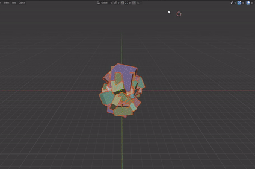

# Spread Objects (for Blender 2.8x/2.9x)

Spread Objects does what it says : it spreads the selected objects on an evenly spaced grid.

It takes care of calculating the number of columns/rows and the spacing needed between each object and another.

To use it, simply select the objects, open the search menu (by pressing F3 or Space, depending on your settings) and search for "spread objects" and select it.
